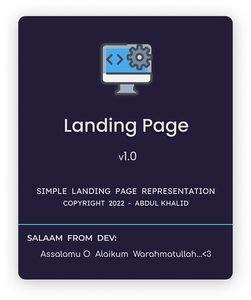

<h1 align="center"> Project - Landing Page </h1>

### Project Preview:

---

### Live Demo: [&nbsp; Click here](https://0xAbdulKhalid.github.io/Odin-Project-Workspace/Landing-Page/ "Project Link")

---

## About:  

---

## What I Learned:
+ To Use Flexbox Layout Effectively.
+ Learned to design page according to Box-Model.
+ Tried to built this project as Mobile Responsive.

---

 
<h3 align="center"> Copyright 2022 - <a href="https://github.com/0xAbdulKhalid">Abdul Khalid</a></h3>
 